# Workout App

## Deskripsi Aplikasi

Sebuah aplikasi android untuk menunjang aktivitas workout sesorang dengan spesifikasi sebagai berikut ini:
1. Sport News : pengguna dapat melihat berita olahraga yang diperoleh dari Indonesia Sport New API.
2. Training Tracker: pengguna dapat melakukan mulai dan selesai untuk **pelacakan** olahraga dengan jenis berikut inti
    1. Sepeda : melacak jarak dan rute yang dilalui menggunakan GPS
    2. Walking/Running : melacak jumlah step yang dilakukan pengguna
3. Training History: terdapat training history yang menyimpan seluruh kegiatan latihan dengan ditampilkan dalam bentuk calendar
4. Training Scheduler: pengguna dapat menentukan jadwal latihan yang dapat dikustomisasi untuk berjalan secara:
    a. Satu waktu spesifik
    b. Rutin per hari
    c. Rutin per hari tertentu

## Cara Kerja Aplikasi
### Sport News
1. Melakukan getAll berita yang ada di database
2. Kemudian disimpan ke dalam CardView menggunakan NewsAdapter
3. Setelah itu kelas CardView dimasukan ke dalam ViewRecycle
4. Jika jika dari CardView diklik maka akan menampilkan berita menggunakan WebView
### Training Tracker
1. Menampilkan halaman start tracking dengan pilihan aktivitas dan stop atau start
2. Jika diklik start maka tracking akan dimulai dan akan melakukan subscribe ke observer untuk mendapatkan lokasi perangkat
3. Setelah kondisi tidak sedang tracking maka hasil tracking tersebut akan disimpan ke dalam database
4. Kemudian menampilkan halaman TrackerViewer dengan menampilkan hasil tracking terbaru
### Training History
1. Menampilkan halaman fragment_training_history untuk menampilkan calendar dan pick date yang akan dicek
2. Date akan dipassing ke fragment_history_list dan dimasukan ke TextView
3. Gunakan Date untuk mencari ke tracker database apakah ada data sesuai tanggal tersebut
4. Kemudian masukan instance hasil query ke adapter untuk menghasilkan kelas grid_history
5. Masukan grid_history ke recycleview
6. Berdasarkan jika diklik grid tersebut maka hasil tracking akan ditampilkan pada TrackerViewer 
### Traning Scheduler
1. Menampilkan halaman TrainingScheduler
2. Disana terdapat button untuk delete dan tambah
3. Jika tampbah maka akan dinavigasikan ke tampilan AddScheduleFragment
4. Setelah itu data akan dimasukan ke database ke database dan ke tampilan TrainingSchedule

## Library dan Justifikasinya
1. Picasso: untuk melakukan download gambar dari link eksternal dan menyimpan image tersebut
2. Glide: untuk memasukkan bitmap pada suatu imageView
3. Retrofit: untuk melakukan request terhadap eksternal API
4. Converter-GSON: Untuk mengolah JSON menjadi objek Java atau sebaliknya
5. OkHttp: Untuk melakukan interceptor terhadap request
6. Maps SDK Android: Untuk melakukan tracking location pada peta
7. Coroutines: Untuk melakukan coroutines dan lifecycle
8. Room: Untuk mengimplementasi database

## Screenshoot Aplikasi
### Sports News
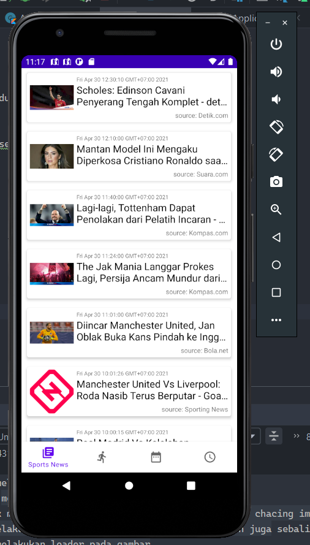  
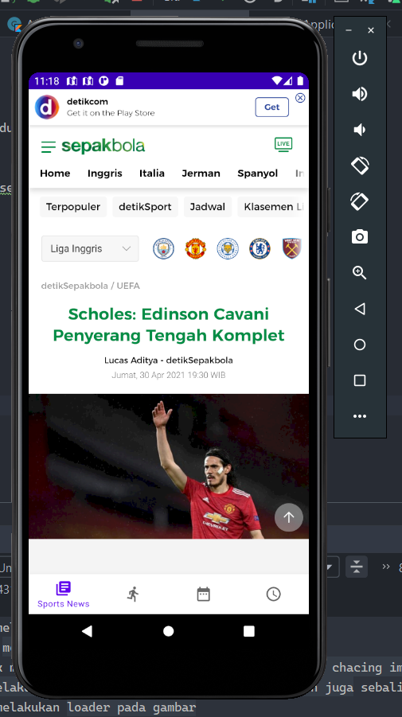  
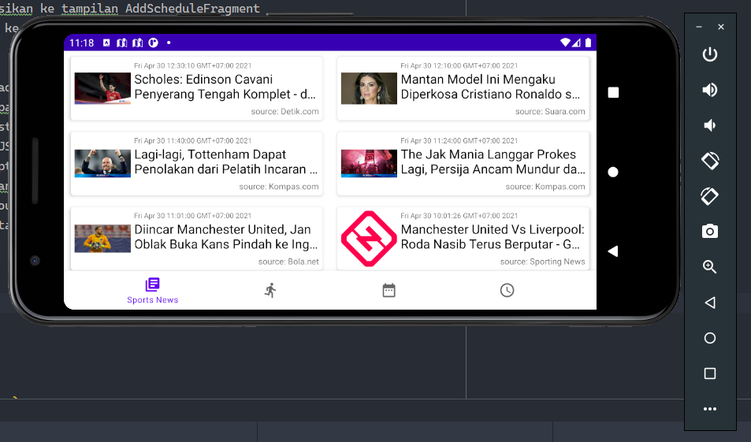  

### Tracker
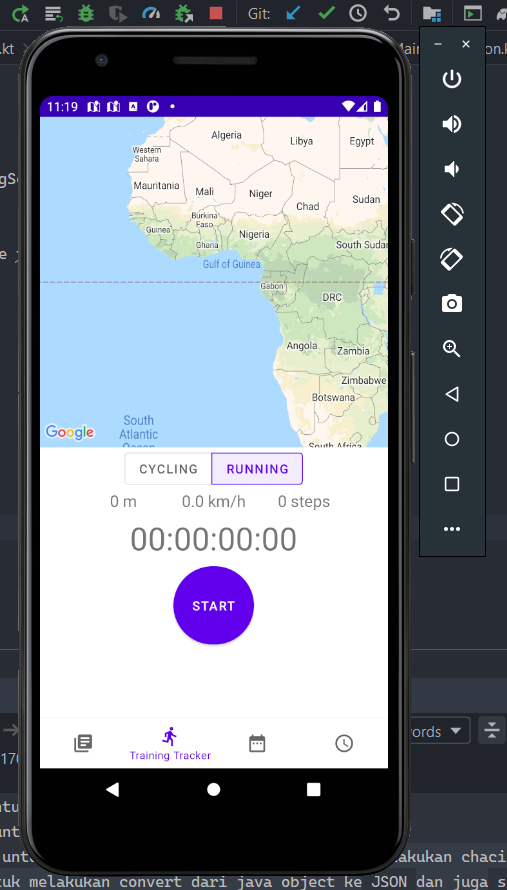  
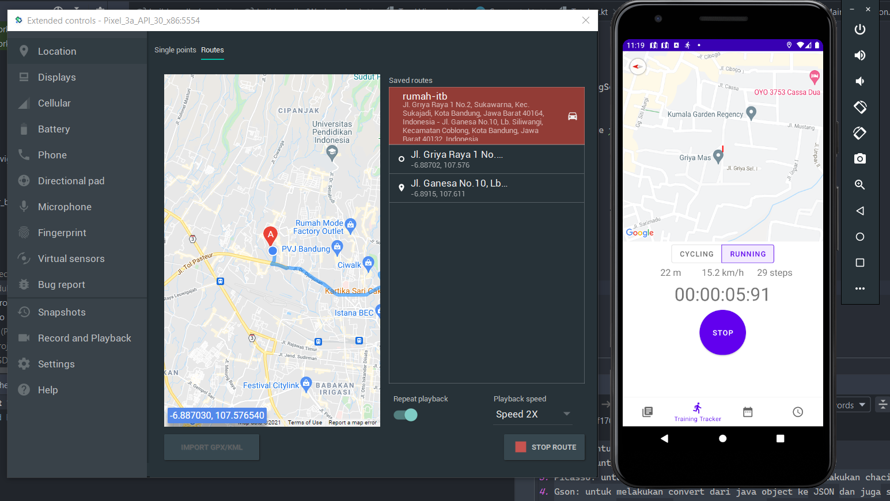  
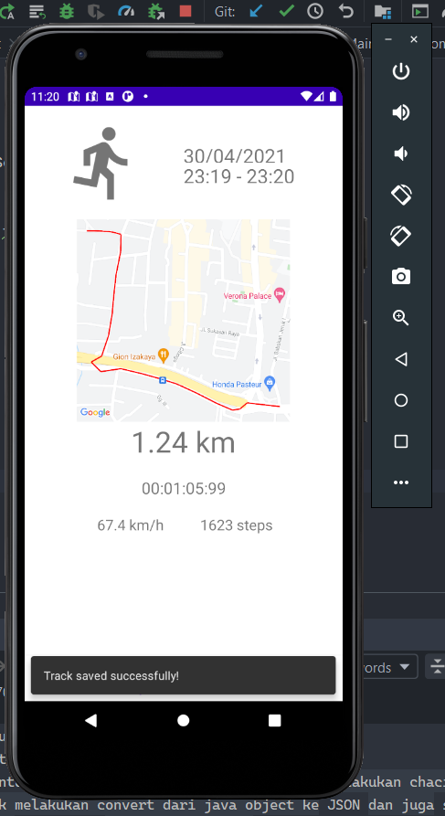  
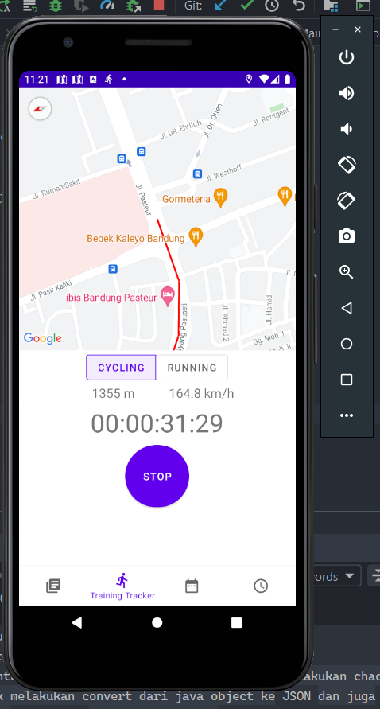  
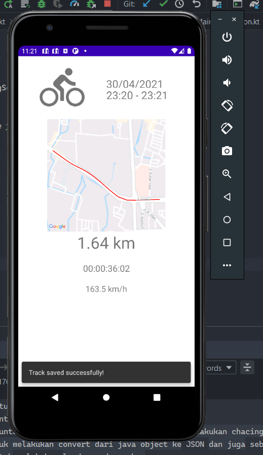  
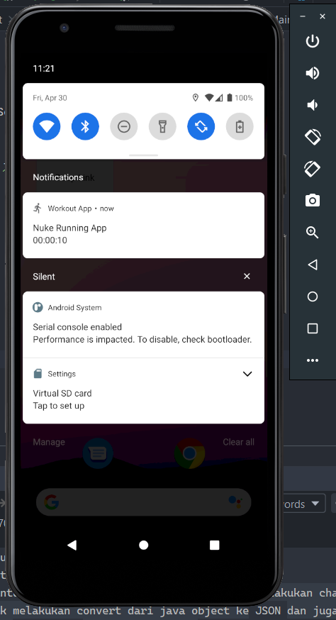  

### History
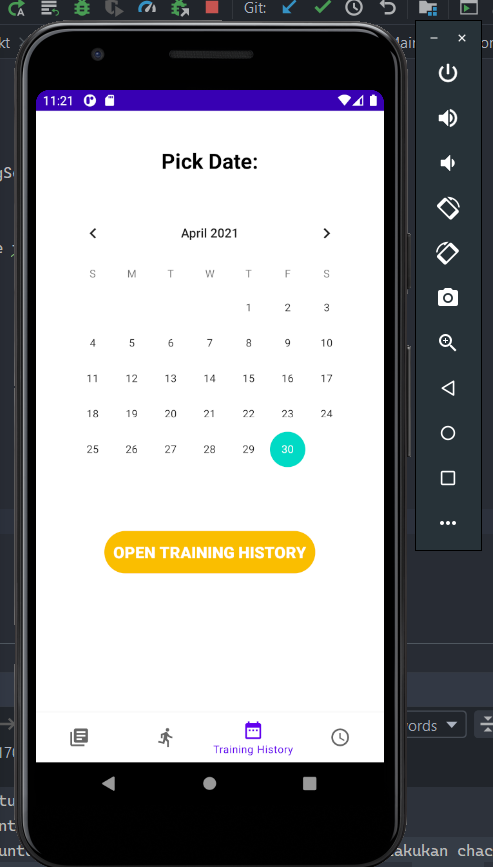  
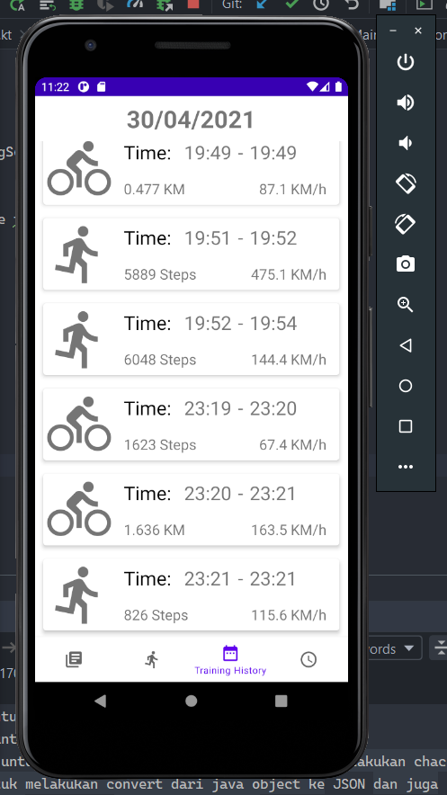  
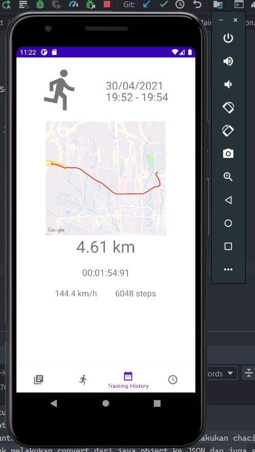  

### Scheduler
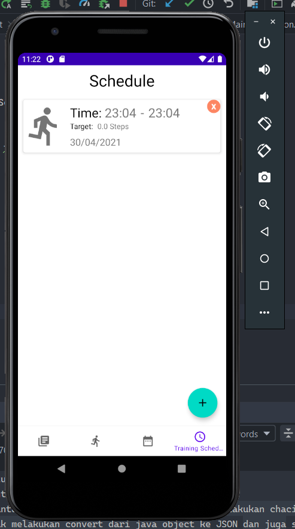  
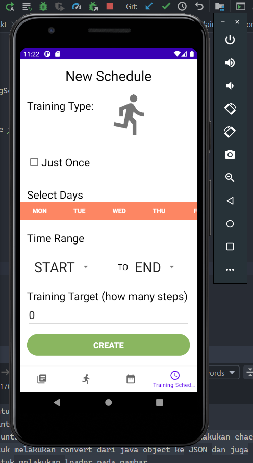  
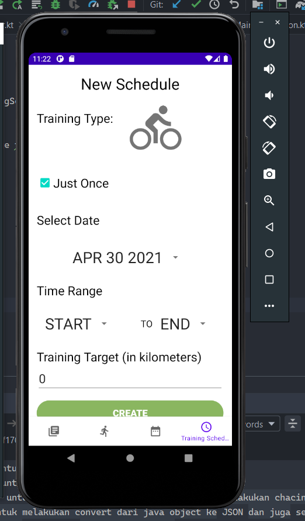  
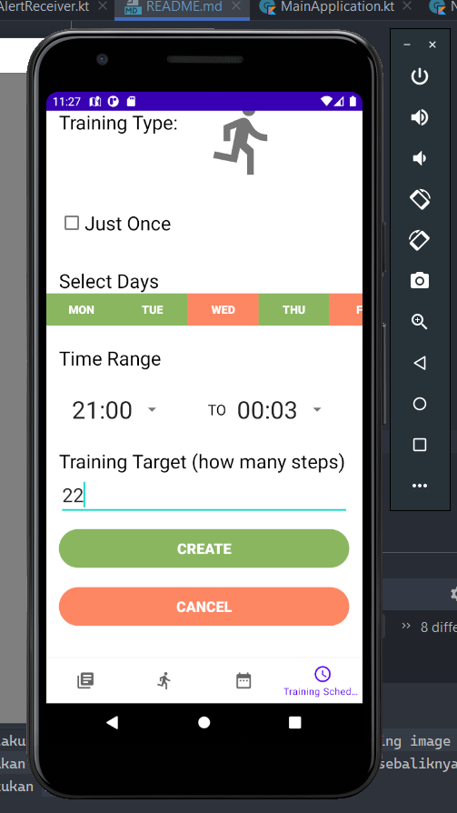  
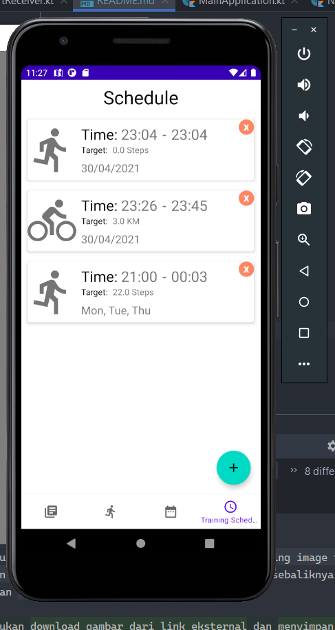  
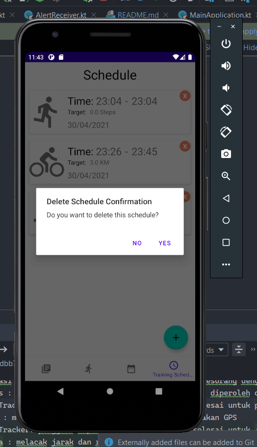  

## Pembagian Kerja
### Fatkhan Masruri 13518053
1. Layout History
2. Dikumentasi Readme
### Iqbal Naufal 13518074
1. Fitur Scheduler (notification)
### Muhammad Kamal Shafi 13518113
1. Fitur SportNews
2. Fitur History
3. Scheduler Layout, UI dan Logic
4. Navigation
### Faris Rizki Ekananda 13518125
1. Fitur Tracking
2. Init Database, TrackerDAO dan Main Application
3  Integrasi Maps SDK Android Google
4. Tracker Viewer Fragment

Tugas Besar 3 IF3210 Workout App pada platform Android menggunakan Kotlin